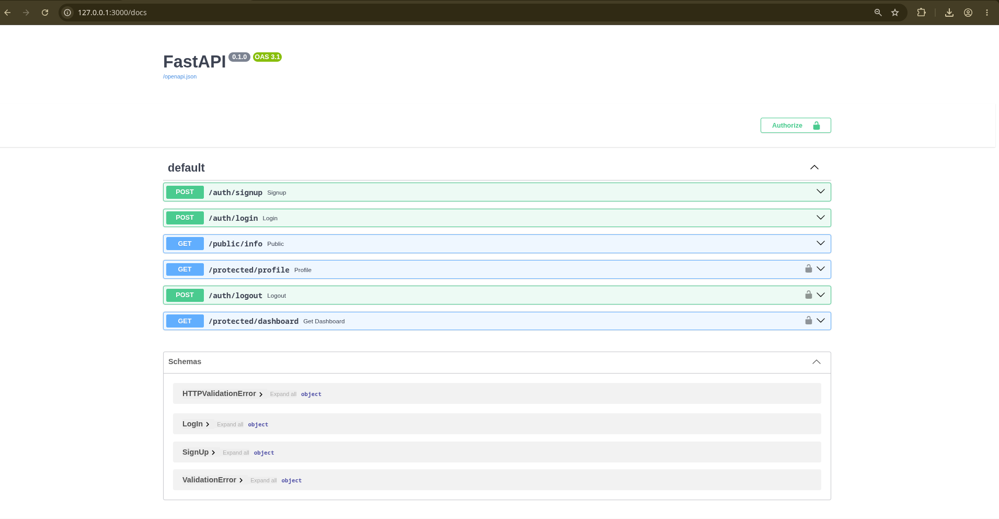

# FastAPI & Supabase Authentication Service

A lightweight, production-ready REST API built with **FastAPI** and integrated with **Supabase Auth** for user authentication and authorization management.

---

## Table of Contents
- [About the Project](#about-the-project)
- [Project Architecture](#project-architecture)
- [Local Environment Setup](#local-environment-setup)
- [Running the Application](#running-the-application)
- [API Reference](#api-reference)
- [Swagger Documentation Screenshot](#swagger-documentation-screenshot)

---

## About the Project

This project provides a robust authentication framework featuring public and protected routes using JWT bearer tokens validated against Supabase.

### Features
* **User Sign Up & Log In**: Seamless user registration and authentication via Supabase Auth.
* **Token Verification**: Custom security dependency (`verify_token`) to guard sensitive routes.
* **Public & Protected Endpoints**: Clear separation between accessible and authentication-required resources.
* **Session Management**: Dedicated logout endpoint to invalidate active sessions.

---

## Local Environment Setup

1. **Clone the repository** (if applicable):
   ```bash
   git clone <repository-url>
   cd <repository-directory>
   ```

2. **Create a virtual environment**:
   ```bash
   python -m venv venv
   source venv/bin/activate  # On Windows use: venv\Scripts\activate
   ```

3. **Install dependencies**:
   ```bash
   pip install -r requirements.txt
   ```

4. **Set up Environment Variables**:
   Create a `.env` file in the root directory of the project and define the following variables:

   ```env
   SUPABASE_URL=https://your-supabase-project-id.supabase.co
   SUPABASE_KEY=your-supabase-anon-or-service-role-key
   PORT=3000
   ```

---

## Running the Application

Start the FastAPI server locally using `uvicorn`:

```bash
uvicorn main:app --host 0.0.0.0 --port 3000 --reload
```

Once running, the application will be accessible at `http://localhost:3000`.

---

## API Reference

| Endpoint | Method | Description | Requires Auth |
| :--- | :---: | :--- | :---: |
| `/auth/signup` | `POST` | Registers a new user with email and password | **No** |
| `/auth/login` | `POST` | Authenticates a user and returns access/refresh tokens | **No** |
| `/public/info` | `GET` | Returns public informational message | **No** |
| `/protected/profile` | `GET` | Retrieves user profile data using Bearer Token | **Yes** |
| `/protected/dashboard` | `GET` | Retrieves dashboard data using verified Bearer Token | **Yes** |
| `/auth/logout` | `POST` | Invalidates current session and signs out the user | **Yes** |

---

## Swagger Documentation Screenshot

Interactive API documentation generated automatically by FastAPI is available at `/docs`.

